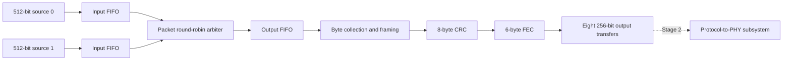
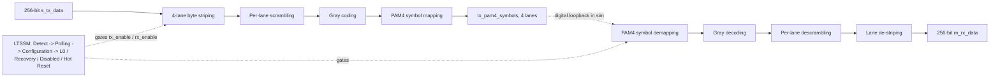

# SemiCON-FabricATE

A synthesizable SystemVerilog transmit subsystem for the SARCathon AXI4-to-PCIe
challenge. It combines two 512-bit AXI4-Stream sources, assembles 256-byte frames,
generates CRC and FEC bytes, and emits eight 256-bit transfers per frame. A second
stage, added in this submission, carries that 256-bit frame data the rest of the
way to a 4-lane digital PAM4 PHY interface with its own link-training state
machine. See [Stage 2: Protocol-to-PHY digital subsystem](#stage-2-protocol-to-phy-digital-subsystem)
below.

**Status:** transmit framing, CRC and FEC are implemented and tested. The payload
format is a Stage 1 application-data prototype, not a complete PCIe-compliant
bridge. No vendor controller IP is instantiated.

## Quick start

Requirements:

- Python 3.9 or newer; only standard-library packages are used.
- Icarus Verilog (`iverilog` and `vvp`) on PATH. Recorded tests used version 13.0.
- Optional: a VCD waveform viewer, such as GTKWave.
- Optional: Yosys for structural synthesis.

```sh
git clone https://github.com/cyberaionics/SemiCON-FabricATE.git
cd SemiCON-FabricATE
./sim/run_all.sh
```

Use `py -3` on Windows or `python3` on Linux/macOS if that is your Python command.
The Python runner does not require Bash or WSL. Windows Icarus installations also
need their runtime DLLs available. An existing project-local
`.tools/mingw64/bin` installation is recognized but is not distributed in Git.

The runner compiles tests, generates vectors, runs simulations and writes logs.
Compilation failures, simulation failures or missing PASS results cause a nonzero
exit. Binaries, vectors and compiler logs are generated under `sim/build/`.

## How it works



1. **Buffer inputs.** A transfer occurs on a rising clock edge when VALID and
   READY are high. Producers hold their beat unchanged until accepted.
2. **Arbitrate packets.** The arbiter keeps one source until its accepted LAST
   beat, including during stalls and source gaps. It then prefers the other
   source. Packets cannot interleave.
3. **Collect bytes.** The packetizer scans each 64-byte input beat. It collects
   bytes selected by KEEP in increasing lane order, starting with TDATA[7:0].
   Invalid bytes are discarded here; the upstream interconnect preserves them.
4. **Assemble frames.** Up to 236 application bytes fill each data region.
   Longer packets span frames; short final frames are zero-padded. Different
   application packets never share a frame.
5. **Generate protection.** CRC covers bytes 0-241. FEC covers bytes 0-249,
   including the completed CRC. Their GF(256) field polynomials differ.
6. **Emit eight transfers.** Output data and metadata remain stable whenever
   VALID is high and READY is low.

### Frame format

| Byte offsets | Size | Contents |
|---|---:|---|
| 0-235 | 236 bytes | Application data followed by zero padding |
| 236-241 | 6 bytes | Reserved data-link region, currently zero |
| 242-249 | 8 bytes | Computed CRC0 through CRC7 |
| 250-255 | 6 bytes | Computed FEC C1, C2, C0, P1, P2, P0 |

The data region contains raw application bytes. Real PCIe TLP headers, packing
rules and data-link semantics are not implemented. Exact CRC arithmetic and FEC
mapping, with specification references, are in [CRC.md](docs/CRC.md) and
[FEC.md](docs/FEC.md).

### Top level and handshake

Use **`axis_link_tx`** as the integrated top level. FIFO_DEPTH defaults to 4;
input/output widths are fixed at 512/256 bits.

| Signals | Meaning |
|---|---|
| `clk`, `rst_n` | Shared clock and active-low reset |
| `s0_axis_*`, `s1_axis_*` | Input DATA[511:0], KEEP[63:0], LAST, VALID and READY |
| `m_axis_tdata`, `m_axis_tkeep` | Output DATA[255:0] and KEEP[31:0] |
| `m_axis_tvalid`, `m_axis_tready` | Output handshake |
| `m_axis_tlast` | Final, eighth transfer of a frame |
| `m_axis_source` | Original source 0 or 1 |
| `m_frame_bytes` | Application bytes in this frame, 0-236 |
| `m_packet_start`, `m_packet_end` | First/final frame of an application packet |

Output KEEP is all ones during valid transfers: padding and parity are transmitted
bytes. Metadata is repeated on every transfer of its frame. These internal
sidebands are not encoded into the protected bytes; downstream logic must retain
them to reconstruct application packets.

An empty packet produces one frame with byte count zero. Exact multiples of
236 bytes do not create an extra empty frame, including when LAST arrives on a
subsequent all-zero KEEP beat. A full frame waits for another valid byte or packet
end before finalization.

### Reset and performance

Reset aborts pending packets, frames and parity calculations. Reset all connected
stages together and release reset synchronously to the shared clock. There is no
clock-domain crossing, packet timeout or abort protocol. A source that never
completes a packet can block the other source.

The collector scans one lane per cycle, including invalid lanes. Without frame
processing, input handshakes are 66 clocks apart. Each frame adds 242 CRC cycles,
250 FEC cycles and at least eight output cycles. Backpressure extends this.
The implementation is a functional baseline, not optimized for PCIe line rate.

## File structure

Stage 2 (protocol-to-PHY) files sit directly alongside the Stage 1 files in
the same `rtl/`, `tb/`, `sim/`, `synthesis/` and `docs/` directories — there is
no separate subfolder.

```text
SemiCON-FabricATE/
|-- rtl/                         Synthesizable hardware
|   |-- axis_fifo.sv             FIFO for data and metadata
|   |-- packet_rr_arbiter.sv     Packet-held round-robin arbitration
|   |-- axis_interconnect_2to1.sv  Two ingress FIFOs and an output FIFO
|   |-- axis_frame_packetizer.sv  Collection, framing and CRC/FEC sequencing
|   |-- flit_crc8.sv             Eight-byte CRC accumulator
|   |-- flit_fec6.sv             Three-group FEC encoder
|   |-- axis_link_tx.sv          Integrated transmit top level (Stage 1)
|   |-- phy_pkg.sv               Shared types/parameters (Stage 2)
|   |-- ltssm.sv                 Link training and status state machine (Stage 2)
|   |-- lane_striper.sv          256-bit to 4-lane byte striping (Stage 2)
|   |-- lane_destriper.sv        4-lane to 256-bit de-striping (Stage 2)
|   |-- lane_scrambler.sv        Per-lane 23-bit scrambler/descrambler (Stage 2)
|   |-- gray_pam4_tx.sv          Gray coding + PAM4 symbol mapping (Stage 2)
|   |-- gray_pam4_rx.sv          PAM4 symbol demapping + Gray decoding (Stage 2)
|   |-- protocol_to_phy_tx.sv    TX datapath: stripe -> scramble -> Gray/PAM4 (Stage 2)
|   |-- protocol_to_phy_rx.sv    RX datapath: inverse of TX (Stage 2)
|   `-- protocol_to_phy_top.sv   LTSSM + TX + RX integration (Stage 2)
|-- tb/                          Simulation-only testbenches
|   |-- tb_arbiter.sv
|   |-- tb_interconnect.sv
|   |-- tb_link_tx.sv
|   |-- tb_flit_crc8.sv
|   |-- tb_flit_fec6.sv
|   |-- crc_reference.svh        Independent CRC checking functions
|   |-- fec_reference.svh        Independent FEC checking functions
|   |-- tb_integrated.sv         Full-chip, LTSSM-gated PHY loopback (Stage 2)
|   |-- tb_blocks.sv             Block-level striping/Gray/PAM4/scrambling checks (Stage 2)
|   `-- tb_ltssm.sv              LTSSM-only testbench (Stage 2)
|-- sim/
|   |-- run_all.py               Complete Stage 1 Icarus regression
|   |-- run_all.sh / run_all.ps1 Stage 2 protocol-to-PHY regression (Linux/macOS, Windows)
|   |-- crc_vectors.py           Independent CRC vector generation
|   |-- fec_vectors.py           FEC vectors and software correction checks
|   |-- check_fec_reference.py   Optional specification-encoder comparison
|   |-- run.sh                   Original interconnect: Bash/Icarus
|   |-- run_link.sh              Frame pipeline: Bash/Icarus
|   |-- run_verilator.sh         Original interconnect: Verilator
|   |-- *_results.log            Recorded verification evidence (Stage 1 and Stage 2)
|   `-- build/                   Generated binaries/vectors; ignored
|-- synthesis/
|   |-- check.ys                 Original interconnect synthesis
|   |-- check_link.ys            Integrated transmit synthesis
|   |-- run_yosys.ys             Stage 2 protocol-to-PHY synthesis script
|   |-- run_yosys.sh / run_yosys.ps1  Wrappers for run_yosys.ys
|   `-- *_results.log            Recorded synthesis evidence (Stage 1 and Stage 2)
|-- docs/
|   |-- INTERFACE.md             Original interconnect boundary
|   |-- PACKETIZER.md            Frame and sideband contract
|   |-- CRC.md                   CRC arithmetic and ordering
|   |-- FEC.md                   FEC grouping and parity mapping
|   |-- VERIFICATION.md          Executed checks and limitations (Stage 1 and Stage 2)
|   `-- BUILD_PLAN.md            Original planning notes
|-- .gitignore                   Generated/local files excluded
|-- .gitattributes               Consistent text line endings
`-- README.md
```

## Testbenches and simulation

| Testbench | Main checks |
|---|---|
| `tb_arbiter` | Stalled first/final beats, owner gaps, alternating grants and reset |
| `tb_interconnect` | Independent per-source scoreboards; data/KEEP/LAST integrity, ordering and reset flushing |
| `tb_flit_crc8` | 32 reference vectors, enable gaps, clear/reset and corruption checks |
| `tb_flit_fec6` | 32 patterns plus all 2,000 input basis bits; enable gaps and reset at each group position |
| `tb_link_tx` | Payload, padding, metadata, CRC, FEC, frame boundaries, source ownership, stalls and reset during processing |

The runner uses seeds 12345, 67890 and 314159. Interconnect width/depth cases are
512/4, 512/1 and 64/3. Frame tests cover the standalone packetizer and integrated
FIFO depths 4, 1 and 3.

Packet lengths include 0, 1, 31, 32, 33, 63, 64, 65, 235, 236, 237, 472, 473
and 2048 bytes, plus other deterministic lengths. Tests exercise sparse/null
KEEP, long packets, exact boundaries and stalls at all eight output positions.

### Recorded results

| Evidence | Result |
|---|---|
| `sim/icarus_results.log` | Arbiter plus nine original runs passed; 10,800 delivered beats |
| `sim/link_results.log` | 12 runs passed; 840 packets / 2,716 frames, plus a waveform repeat |
| `sim/crc_results.log` | 32 vectors passed; checker rejected 2,128 corrupted codewords |
| `sim/crc_matrix_results.log` | Python reference matched 1,936 specification matrix basis inputs |
| `sim/fec_results.log` | FEC RTL matched all 2,032 vectors |
| `sim/fec_reference_results.log` | Specification reference encoder matched those vectors |
| `sim/fec_correction_results.log` | Software model restored 2,302 injected-error frames |

The runner regenerates **`sim/link_tx.vcd`**. Open it in a waveform viewer to
inspect DATA, VALID/READY, LAST, source, byte count and packet flags. VCD files
are ignored by Git; compact result logs remain verification evidence.

Optional matrix/reference comparisons require externally supplied specification
files and are not part of the default regression. Commands are in
[CRC.md](docs/CRC.md) and [FEC.md](docs/FEC.md). Reference files and local
compatibility copies are not distributed. The correction model is Python
verification code, not a synthesized receiver.

For narrower runs, use:

```sh
bash sim/run.sh
bash sim/run_link.sh
bash sim/run_verilator.sh
```

The Verilator script covers the **original interconnect only** and needs a C++
toolchain. Use the Python/Icarus runner for the complete current subsystem.

## Synthesis

With Yosys installed, run from the repository root:

```sh
yosys -l synthesis/link_structural_results.log synthesis/check_link.ys
```

This synthesizes `axis_link_tx` and runs `check -assert`. Recorded Yosys 0.68
results show zero structural problems, no inferred latches and 38,148 generic
primitive cells. Small FIFO memories become registers, producing the expected
warning. The script uses `-noabc`, so it does not perform technology mapping.

These results do not establish device area, timing closure, FPGA fit or GDSII.
Only the seven files under `rtl/` belong in the integrated synthesis source
list. Testbenches are not synthesizable. A board demonstration also needs a
board-specific wrapper, clock/reset conditioning and pin constraints; wide
stream buses should remain internal.

## Changes from the original starter

1. Added the packetizer and integrated wrapper: byte compaction, padding,
   packet splitting, metadata and 256-bit frame output.
2. Added CRC generation and independent vectors/syndrome checks.
3. Added FEC generation, reference-encoder comparison, basis-vector tests and
   a verification-only correction model.
4. Added the complete Python regression runner, integrated synthesis script,
   waveform generation and detailed implementation/result documentation.
5. Excluded generated builds, downloaded tools and waveforms from Git, while
   retaining sources, scripts, documentation and compact result logs.
6. Added the protocol-to-PHY files: lane striping, scrambling, Gray/PAM4
   symbol mapping and an integrated LTSSM, extending the pipeline from the
   256-bit frame output toward the PHY boundary. These files sit alongside
   the Stage 1 sources in the same `rtl/`, `tb/`, `sim/`, `synthesis/` and
   `docs/` directories. See below.

## Commit and push

GitHub recognizes the existing `README.md` filename. Local tool installations,
simulation executables, Python caches and waveforms should not be staged.
The documented commands regenerate these files.

Review and publish from the repository root:

```sh
git status --short
git diff --check
git add README.md .gitignore .gitattributes rtl tb sim synthesis docs
git diff --cached --stat
git commit -m "Document and integrate transmit packetizer, CRC, FEC and protocol-to-PHY stage"
git push -u origin HEAD
```

Inspect the staged changes before committing. The push publishes your current
branch and requires write access to the configured remote. No force push is needed.

## Remaining work

- Receive-side FEC correction and CRC checking in synthesizable RTL.
- Real TLP/DLP encoding, descriptors, transactions, replay and credits.
- Throughput optimization, application workloads and broader verification.
- Technology-mapped synthesis, timing analysis, physical design and GDSII.
- Analog SerDes, TX driver, RX analog front end, CDR, CTLE/equalization,
  package/PCB channel and electrical compliance (see Stage 2 scope below).

Memory-mapped AXI4 AW/W/B/AR/R interfaces, a general N-by-M crossbar and a board
wrapper are also outside the current implementation. See
[VERIFICATION.md](docs/VERIFICATION.md) for the limits of the executed checks.

---

## Stage 2: Protocol-to-PHY digital subsystem

Adds new files directly into `rtl/`, `tb/`, `sim/`, `synthesis/` and `docs/`
(listed with "(Stage 2)" in the file structure above) rather than a separate
subfolder. This stage is meant to pick up where `axis_link_tx` leaves off: it
takes 256-bit data and carries it down to a 4-lane parallel digital
PAM4-symbol interface, and adds the link-training state machine (LTSSM) that
gates when the datapath is allowed to run. **The two stages are not yet wired
together** — `protocol_to_phy_top`'s `s_tx_data`/`m_rx_data` are independent
256-bit ports, not connected to `axis_link_tx`'s `m_axis_tdata`; see Remaining
work below.

**Scope boundary:** the RTL ends at the 4-lane parallel digital PAM4-symbol
interface to the analog/high-speed PHY. It does not model the analog SerDes, TX
driver, RX analog front end, CDR, CTLE/equalization, package/PCB channel, or
electrical compliance.



### What's implemented

- 256-bit digital datapath, 4-lane byte striping and de-striping.
- Per-lane PCIe-oriented 23-bit scrambling and descrambling.
- Gray coding/decoding and 2-bit symbol representation for PAM4.
- An LTSSM covering Detect, Polling, Configuration, L0, Recovery, Disabled and
  Hot Reset, which gates TX/RX datapath operation.
- An integrated, self-checking digital loopback testbench and VCD waveform
  generation.

### Top level

`protocol_to_phy_top` instantiates the LTSSM plus the TX and RX datapaths.

| Signals | Meaning |
|---|---|
| `clk`, `rst_n` | Shared clock and active-low reset |
| `phy_rx_detected`, `training_done`, `link_width_ok`, `lane_config_ok` | LTSSM link-bring-up inputs |
| `recovery_request`, `phy_error`, `disable_request`, `hot_reset_request` | LTSSM control inputs |
| `s_tx_data`, `s_tx_valid`, `s_tx_ready` | 256-bit TX data in |
| `tx_pam4_symbols`, `tx_valid`, `tx_lane_valid` | 4-lane PAM4 symbol output |
| `rx_pam4_symbols`, `rx_valid` | 4-lane PAM4 symbol input |
| `m_rx_data`, `m_rx_valid`, `m_rx_ready` | 256-bit RX data out |
| `link_up`, `tx_enable`, `rx_enable`, `training_enable`, `recovery_active` | LTSSM status outputs |
| `ltssm_state`, `ltssm_state_changed` | Current LTSSM state and a change strobe |

### Quick start

This is a separate regression from Stage 1's `python sim/run_all.py`.

Windows PowerShell:

```powershell
./sim/run_all.ps1
```

Linux/macOS:

```bash
bash sim/run_all.sh
```

The integrated testbench generates `sim/integrated.vcd` (and
`sim/blocks.vcd`, `sim/ltssm.vcd` from the other two runs). Open it in
GTKWave and inspect `ltssm_state`, `link_up`, `tx_enable`, `rx_enable`,
`s_tx_data`, `tx_pam4_symbols`, `rx_pam4_symbols`, `m_rx_data`, and the
valid/ready signals.

### Verification

The integrated testbench (`tb/tb_integrated.sv`) exercises reset and link
bring-up, invalid link-width configuration blocking L0, directed payload
patterns, RX ready/valid backpressure, PAM4-symbol corruption visible at the
reconstructed RX data, explicit Recovery and independent `phy_error` triggers,
post-Recovery transfer, 100 randomized 256-bit transactions, Disabled/retraining,
and Hot Reset. It continuously checks that `tx_enable` only asserts in L0,
`link_up`/`recovery_active` track the LTSSM state, `tx_valid` cannot assert while
TX is disabled, and that all four lane-valid bits assert together on a valid TX
symbol beat. A separate block-level testbench (`tb/tb_blocks.sv`) checks lane
striping/destriping, Gray/PAM4 inverse mapping and scrambler/descrambler
round-trip behavior. Full detail, including the recorded results below, is in
the "Protocol-to-PHY integration verification" section of
[`docs/VERIFICATION.md`](docs/VERIFICATION.md).

### Synthesis

With Yosys installed, run `synthesis/run_yosys.ps1` (Windows) or
`synthesis/run_yosys.sh` (Linux/macOS) from the repository root, or directly:

```sh
yosys -l synthesis/phy_structural_results.log synthesis/run_yosys.ys
```

This is technology-independent `-noabc` synthesis of `protocol_to_phy_top`
followed by `check -assert`; it does not claim device-specific area, timing,
utilization or GDSII, since those depend on a selected PDK/library that isn't
bundled here.

### Recorded results

| Evidence | Result |
|---|---|
| `sim/phy_integrated_results.log` | All 13 integrated test cases (bring-up, invalid link width, directed payloads, backpressure, symbol corruption, Recovery, `phy_error`, 100 randomized transactions, Disabled/retrain, Hot Reset) and the continuous assertions passed; summary reports 113 checks/transactions |
| `sim/phy_blocks_results.log` | All 4 block-level checks passed (striping/destriping, Gray/PAM4 inverse, scrambler round-trip, second directed pattern) |
| `sim/phy_ltssm_results.log` | All 3 standalone LTSSM checks passed (reach L0, Recovery returns to L0, Disabled returns to Detect) |
| `synthesis/phy_structural_results.log` | `hierarchy`/`synth -noabc`/`check -assert` completed with zero reported problems; 2 expected warnings (LFSR memories replaced by registers); 7,758 primitive cells, 4,171 wires |
| `sim/integrated.vcd`, `sim/blocks.vcd`, `sim/ltssm.vcd` | Waveforms for the three simulation runs above |

Recorded with Icarus Verilog 12.0 (stable) and Yosys 0.33. As with Stage 1,
these `.vcd` files are typically excluded from Git (`*.vcd` in `.gitignore`);
the compact `*_results.log` files referenced above and in
[`docs/VERIFICATION.md`](docs/VERIFICATION.md) remain the verification
evidence.

### Not modeled

- Analog SerDes, actual FPGA transceiver electrical behavior.
- CDR/equalization.
- Physical PCIe connector signaling.
- Complete PCIe controller/link-layer packetization (that's what the
  `axis_link_tx` stage above provides, at the frame level, not the wire level).
- Full compliance-level LTSSM timing/training ordered sets.

The specific files that make up this stage are listed with "(Stage 2)" in the
top-level [File structure](#file-structure) section above.
